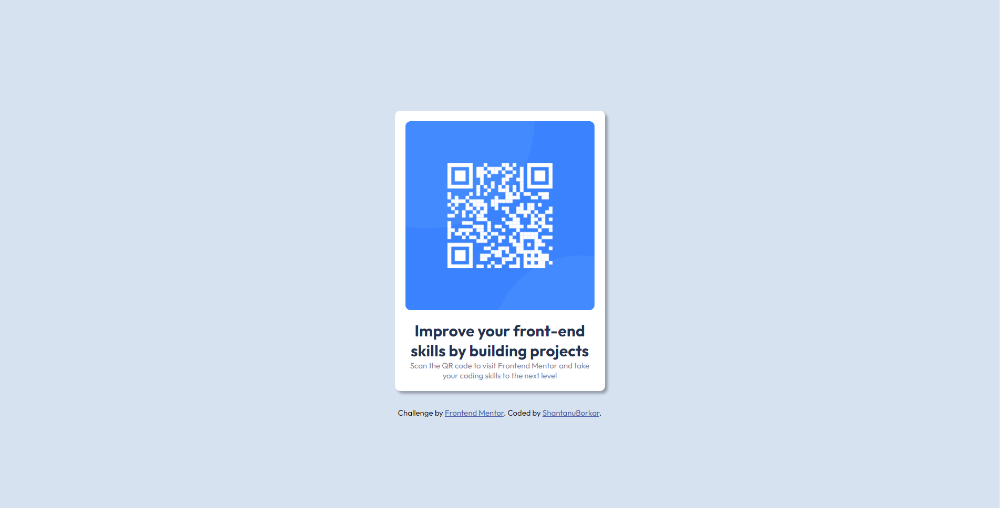

# Frontend Mentor - QR code component solution

This is a solution to the [QR code component challenge on Frontend Mentor](https://www.frontendmentor.io/challenges/qr-code-component-iux_sIO_H). Frontend Mentor challenges help you improve your coding skills by building realistic projects. 

## Table of contents

- [Overview](#overview)
  - [Screenshot](#screenshot)
  - [Links](#links)
- [My process](#my-process)
  - [Built with](#built-with)
  - [What I learned](#what-i-learned)
  - [Continued development](#continued-development)
  - [Useful resources](#useful-resources)
- [Author](#author)
- [Acknowledgments](#acknowledgments)

**Note: Delete this note and update the table of contents based on what sections you keep.**

## Overview
After starting to learn HTML and CSS one week has passed and i have finally created my first website. 

### Screenshot

### Links

- Live Site URL: [Live Site](https://qr-code-challenge-sb.netlify.app/)

## My process

### Built with

- Semantic HTML5 markup
- CSS custom properties
- Flexbox

### What I learned

Creating this website helped me understand:
  
  - How to center objects using Flexbox
  - How to create rounded images and containers

### Continued development

  - I would like to add some Transitions or Animations in future. 

### Useful resources

- [Youtube Video](https://www.youtube.com/watch?v=JFyMWwOxHYM) - This helped me for understand how to center an image properly

## Author

- Frontend Mentor - [ShantanuBorkar](https://www.frontendmentor.io/profile/ShantanuBorkar)

- GitHub - [ShantanuBorkar](https://github.com/AlsoShantanuBorkar)

## Acknowledgments

  I would like to thank my friends for introducing me to WebDevelopment 

**Note: Delete this note and edit this section's content as necessary. If you completed this challenge by yourself, feel free to delete this section entirely.**
